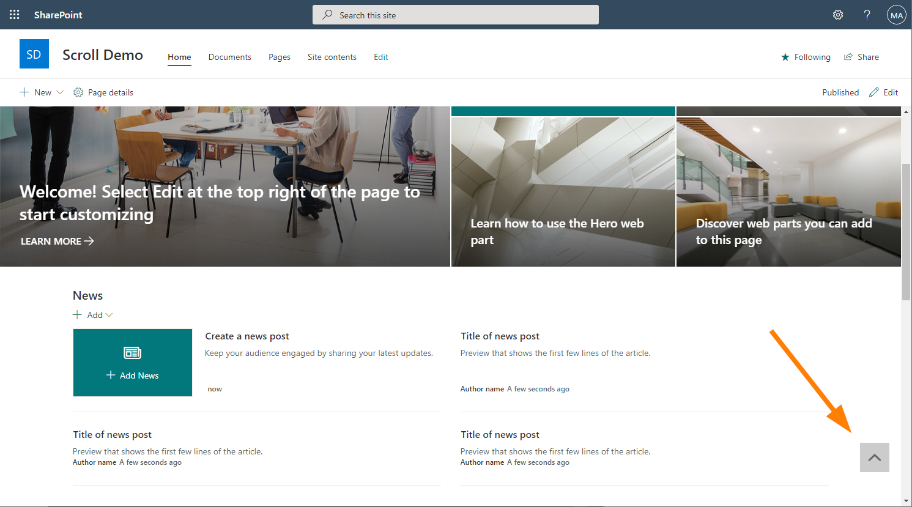

# Scroll to Top Button for Site Pages

## Summary

Adds a button to modern site pages to scroll back to the top of the page.

## Used SharePoint Framework Version

## Setup Instructions
### Pre-requisites
- App Catalog: Ensure the [App Catalog](https://docs.microsoft.com/en-us/sharepoint/use-app-catalog) is setup in your SharePoint Online tenant.

### Tenant Installation
1. Download the latest SPFx package file from [releases](https://github.com/bschlintz/spfx-scrolltotop/releases/latest) or clone the repo and build the package yourself.
1. Upload sppkg file to the 'Apps for SharePoint' library in your Tenant App Catalog.
1. Click Deploy.

### Site Installation
1. Click 'Add an app' on your target site.
1. Click on the `Scroll to Top Button for Site Pages` app to install it.
1. Go to a non-home Site Page to try it out.

## Version history

Version|Date|Comments
-------|----|--------
1.0.0|March 21, 2021|Initial release

## Disclaimer
Microsoft provides programming examples for illustration only, without warranty either expressed or implied, including, but not limited to, the implied warranties of merchantability and/or fitness for a particular purpose. We grant You a nonexclusive, royalty-free right to use and modify the Sample Code and to reproduce and distribute the object code form of the Sample Code, provided that You agree: (i) to not use Our name, logo, or trademarks to market Your software product in which the Sample Code is embedded; (ii) to include a valid copyright notice on Your software product in which the Sample Code is embedded; and (iii) to indemnify, hold harmless, and defend Us and Our suppliers from and against any claims or lawsuits, including attorneys' fees, that arise or result from the use or distribution of the Sample Code.